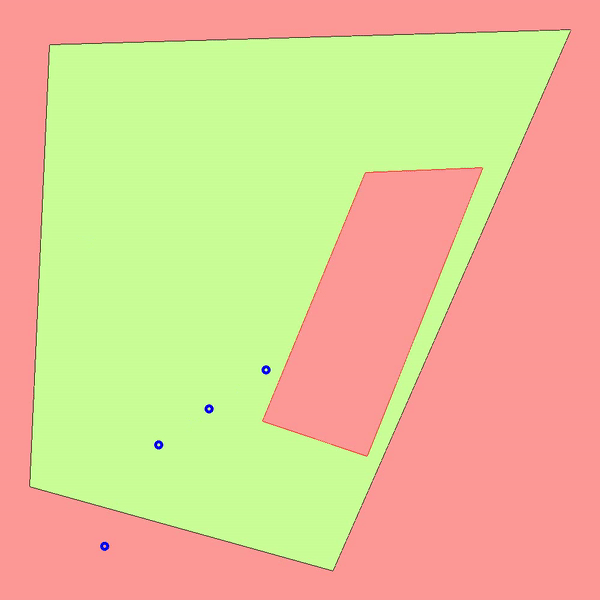

## General Construction Site Hazard Detection Code Workflow

Abstract: 
This Scripts enables to track workers in 3-D space with just a RGB Camera Feed and floor plans of the monitored area.   

Steps to run:
1)  clone the official YoloV7 official repo pip install requirements.txt file
2)	Replace the detect and train files in the Yolov7 original repo. Run inference by using trained weights on your frames to identify workers and output their frame-frame feet positions.

3)	Run updatedpixel2world, reading in frame-frame feet potions and pick hazard and worksite boundary points from Floorplans. This Outputs individual construction site map frames stored in project images directory.

4)	Load project images into VideoGenerator.py to stitch the images into output video. 
    a.	Output Video stored as MAPS.mp4

